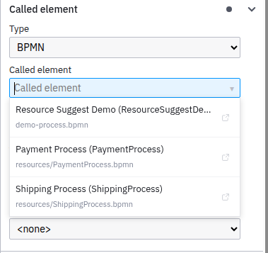

# Camunda Resource Suggest

A resource suggestion plugin for [Camunda Modeler](https://github.com/camunda/camunda-modeler) targeting **Camunda 7**.

Replaces plain text inputs for resource references with searchable comboboxes that show matching DMN decisions, BPMN processes, forms, and message definitions from your project directory.

<p align="center">
  
</p>

## Features

- **Searchable dropdown** — type to filter resources by name, ID, or file path
- **Full context** — each suggestion shows the human-readable name, technical ID, and relative file path
- **Four reference types** — DMN decision reference, Call Activity called element, User Task form reference, and message event names
- **Live file watching** — uses the modeler's built-in FileContext system to detect file changes in real time
- **Free-text fallback** — type any ID not in the list and press Enter to accept it (creatable combobox)
- **Settings integration** — configure the scan directory in the modeler's Settings modal with a native folder picker

## Supported Fields

| Element Type | Properties Panel Field | Resource Type |
|---|---|---|
| Business Rule Task (Type: DMN) | Decision reference | `.dmn` decisions |
| Call Activity (Type: BPMN) | Called element | `.bpmn` processes |
| User Task (Forms: Camunda Forms) | Form reference | `.form` files |
| Message Start/Intermediate Event | Message name | `.bpmn` messages |

## Installation

1. Clone or download this repository into your Camunda Modeler plugins directory:
   ```
   camunda-modeler/resources/plugins/resource-suggest
   ```

2. Install dependencies and build:
   ```bash
   npm install
   npm run build
   ```

3. Restart Camunda Modeler.

4. Open **Settings** and set the resource directory to your project folder containing `.bpmn`, `.dmn`, and `.form` files.

## Development

```bash
npm install
npm run watch   # rebuild on changes
```

## License

[MIT](LICENSE)
